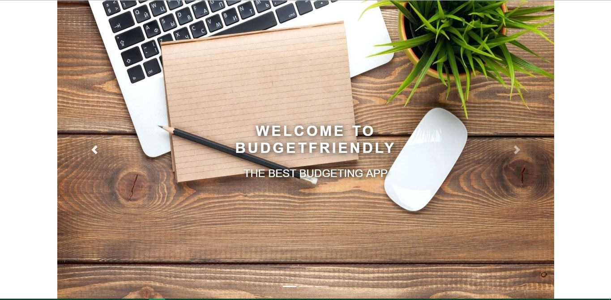

# BudgetFriendly

### Overview

This app uses Handlebars, MySQL, Node, Express, and a Sequelizer to create a Budgetting App. I followed the MVC design pattern and Node to Query the route data for the app. Handlebars was used to generate all of my HTML.

- BudgetFriendly is a spending tracker app that lets users keep track of all their expenses and manage them.

- The App uses passport to security and login. Once user logs in the he can access all his monthly/three monthly and yearly transactions.

- The app will store every all user information in a database.

BudgetFriendly is deployed to Heroku : https://vast-beach-77916.herokuapp.com/

### Technologies Used:

- nodeJS
- Javascript
- Express
- Handlebars
- MySQL
- HTML
- Jquery
- CSS
- Sequelizer

### Instructions:

1. When the app first loads up, you will be introduced with the sliding pages : 

2. As you can see on the 3rd page shown in the image above, there are two buttons: Login and Signup. When you click on the Login button, you will be taken to the login page:

Here, you can log in to your existing account. If the Signup button was clicked on the third slide of the landing page, then you will be directed to the registering page:

3. When you log in through the Login page, you will now be directed to your profile page. As you can see, some values were previously added to the table and is also shown on the pie chart:

4. Basically, once the New Transaction button is clicked, the following modal will show up:

There are 8 Categories: Utilities, Health, Housing, Grocery, Automotive, Enterntainment, Education and Misc. An amount can be entered into the amount box. If left empty, it will be considered as $0 as added in the image below for Utilities on August 3rd: 

5. Now, an amount of $350 is being added for housing: 

6. Once the Add transaction button is clicked, the new table and chart will add the new amount:

7. There are also three buttons for 1 month, 3 months and 1 year that will show you the transaction within this month, the last 3 months, and within the last year:

### Prerequisites:

Node.js - Download the latest version of Node https://nodejs.org/en/
